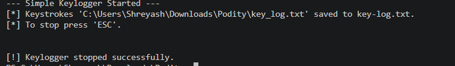

# Simple Keylogger (`keylogger/simple_keylogger.py`)

## What it does
This script records keystrokes and writes them to `key_log.txt`. It stops when you press `ESC`.

## File
- `keylogger/simple_keylogger.py`
- Log output: `keylogger/key_log.txt`

## Prerequisites
- Python 3.x
- `pynput`

### Install
```bash
pip install pynput
```

## Run
```bash
python keylogger/simple_keylogger.py
```

**Screenshot:**




## Safety / legal notice (important)
A keylogger can be used for malicious purposes. Running this script may be blocked by your OS/antivirus and can raise legal/ethical issues.

- Use only with explicit authorization (e.g., your own machine for testing with consent).
- Do not run it on systems/accounts you do not own.

## How to stop
- Press `ESC`

